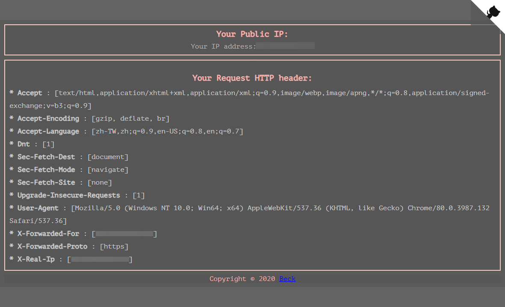

# whatismyip


[](https://app.fossa.com/projects/git%2Bgithub.com%2Fbeckxie%2Fwhatismyip?ref=badge_shield)

> A simple web server that shows your real public IP address.

## Features

- 🌐 Show your real public IP address
- 📋 Display HTTP headers of your request
- 🔌 **API endpoint** for programmatic access
- 🐳 Docker support with multi-stage build

## Demo


[https://ip.beckxie.com](https://ip.beckxie.com)



## API Usage

### Plain Text (for scripts)

```bash
curl https://ip.beckxie.com/api/ip
# Output: 203.0.113.45
```

### JSON Format (detailed info)

```bash
curl "https://ip.beckxie.com/api/ip?format=json"
```

```json
{
  "ip": "203.0.113.45",
  "version": "IPv4",
  "network": {
    "ipv4": "203.0.113.45",
    "ipv6": ""
  },
  "request": {
    "method": "GET",
    "path": "/api/ip",
    "user_agent": "curl/8.0.1"
  },
  "proxy": {
    "detected": true,
    "x_forwarded_for": "203.0.113.45",
    "x_real_ip": "203.0.113.45"
  },
  "timestamp": "2026-01-04T19:30:00+08:00"
}
```

### Script Example

```bash
# Get IP and use in firewall rule
MY_IP=$(curl -s https://ip.beckxie.com/api/ip)
echo "Adding $MY_IP to firewall whitelist..."
```

## How It Works

The server extracts the client IP from HTTP headers in this order:

1. `X-Forwarded-For` (first IP in the list)
2. `X-Real-IP`
3. `RemoteAddr` (direct connection fallback)

> ⚠️ HTTP headers can be modified by the client. For accurate IP detection, always use a trusted reverse proxy.

## Quick Start

### Using Docker (Recommended)

```bash
docker run -p 9999:9999 beckxie/whatismyip:latest
```

### Using Docker Compose

```bash
docker compose up -d
```

### Build from Source

```bash
# Clone the repository
git clone https://github.com/beckxie/whatismyip.git
cd whatismyip

# Build and run
make build
./bin/whatismyip
```

## Command Line Options

```
Usage of whatismyip:
  -p int
        HTTP server port (default 9999)
  -tmpl string
        Template file path (default "./web/template/whatismyip.tmpl")
  -v    Show version
```

## Deployment with Reverse Proxy

For production use, deploy behind a reverse proxy (Caddy, Nginx) to:
- Handle HTTPS/TLS
- Set proper `X-Forwarded-For` headers

See [example/proxy_config/](example/proxy_config/) for configuration examples.

## Development

```bash
# Run tests
make test

# Run linter
make lint

# Build for all platforms
make build

# Build Docker image
make docker-build
```

## License

This project is licensed under the MIT License - see the [LICENSE](./LICENSE) file for details.

[](https://app.fossa.com/projects/git%2Bgithub.com%2Fbeckxie%2Fwhatismyip?ref=badge_large)

## Acknowledgments

- [GitHub Corners](https://github.com/tholman/github-corners)
- [shields.io](https://shields.io/)
