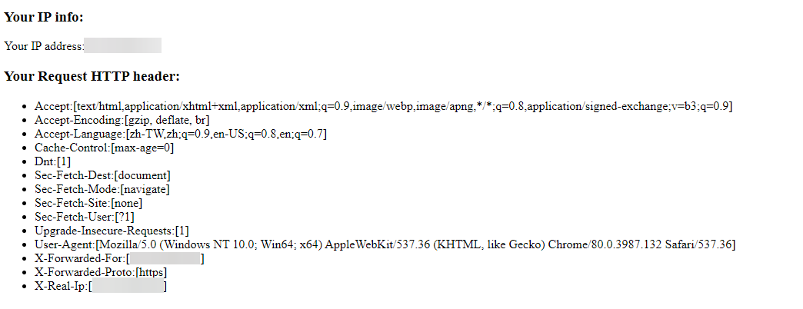

# whatismyip

> This ia a web server that can show your real public IP address.

# Features
- Show your real public IP address.
- Show HTTP headers of your request.

# Snapshots


# Principles

Get first value of HTTP header `X-Forwarded-For`(XFF).

#### HTTP request (Example):

> X-Forwarded-For: `client`, proxy1, proxy2

> note: `HTTP header is modifiable`.

# Prerequisites

- [Go (at least Go 1.11)](https://golang.org/dl/)
- Proxy Server

    According to [Principles], `whatismyip` need the proxy server.
    (See [proxy server config example].)

[Principles]: #Principles
[proxy server config example]: example/proxy_config

# Build
1. `git clone https://github.com/beckxie/whatismyip.git`
2. `make all`

# Deployment
1. Get the executable file by [build] or [download].
2. Run executable file.
### Usage
```
  -p int
        http server port (default 9999)
  -tmpl string
        tmpl file (default "../web/template/whatismyip.tmpl")
  -v    version
```

[download]: https://github.com/beckxie/whatismyip/releases
[build]: #Build

# References

- [HTTP headers | X-Forwarded-For](https://www.geeksforgeeks.org/http-headers-x-forwarded-for/)
- [HTTP 请求头中的 X-Forwarded-For](https://imququ.com/post/x-forwarded-for-header-in-http.html)


# License
This project is licensed under the MIT License - see the [LICENSE] file for details

[LICENSE]: ./LICENSE

# Acknowledgments
[GitHub Corners - tholman/github-corners](https://github.com/tholman/github-corners)